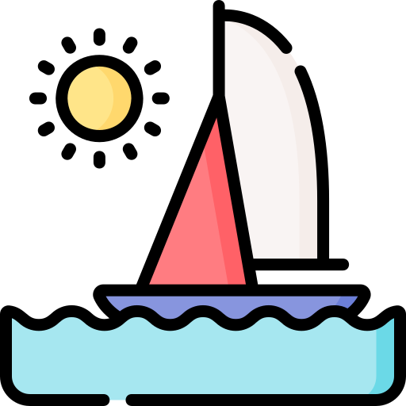
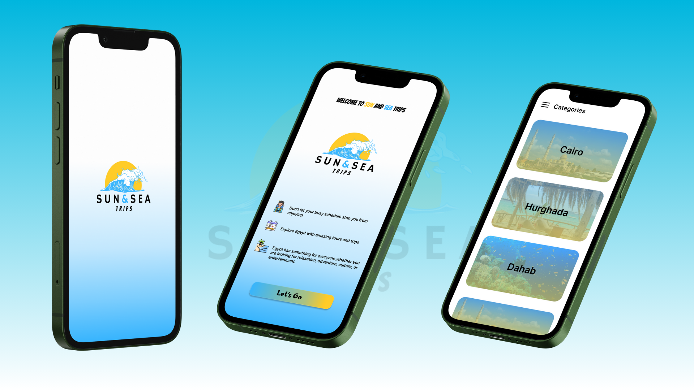
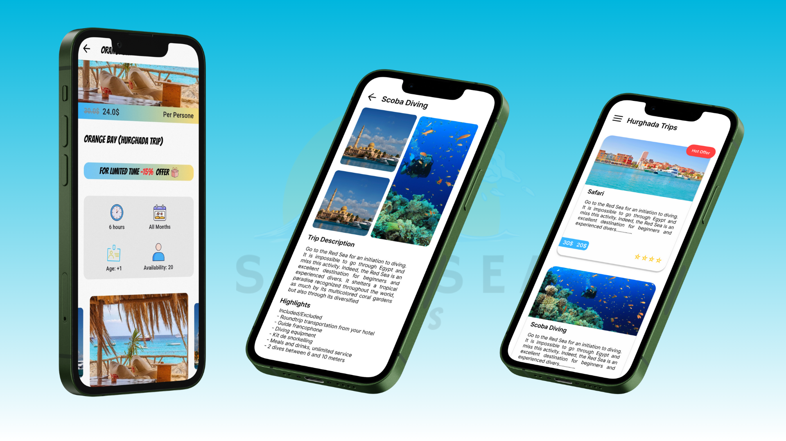

  
  <h1>Sun and Sea - Trips Booking App</h1>

**Sun and Sea** is a mobile application designed to provide users with an easy way to browse, book, and manage trips across Egypt. The app ensures a seamless booking experience with a user-friendly interface, allowing users to explore various travel destinations and make reservations effortlessly.

---

## 🚀 Features

- **User Features:**
  - Browse different categories of trips across Egypt.
  - View detailed trip information, including images, prices, and availability.
  - Book trips instantly through the app.
  - Send messages to the admin for inquiries or support.
  - Enjoy a fully responsive and optimized user experience on mobile devices.

- **Admin Features:**
  - Add, update, or remove trips in real time.
  - Manage user messages and respond to inquiries.
  - Oversee bookings and ensure smooth platform operations.

---

## 📸 Screenshots

 Image 1 | Image 2 |
|---------|---------|
|  |  |

---

## 🛠️ Technologies & Tools

Sun and Sea is developed using modern technologies and best practices to ensure scalability and performance:

- **Framework:** Flutter
- **State Management:** Bloc Cubit
- **Networking:** Dio for API calls
- **Database:** Firebase / MySQL
- **Local Storage:** Shared Preferences & Secure Storage
- **Navigation:** GoRouter
- **Offline Support:** Flutter Offline
- **Notifications:** Local and Push Notifications

### Key Packages

- **[flutter_bloc](https://pub.dev/packages/flutter_bloc):** State management.
- **[flutter_svg](https://pub.dev/packages/flutter_svg):** Handling SVG images.
- **[dio](https://pub.dev/packages/dio):** Networking and API integration.
- **[flutter_local_notifications](https://pub.dev/packages/flutter_local_notifications):** Managing notifications.
- **[flutter_secure_storage](https://pub.dev/packages/flutter_secure_storage):** Secure data storage.

  

---

## 📝 Usage

- The app enables users to explore and book trips easily through a smooth interface.
- Users can send inquiries to admins and receive responses promptly.
- Admins can manage trip listings and user interactions efficiently.
- The app is designed to work seamlessly online and offline.

---

## 👨‍💻 Architecture

The app follows the **MVVM** architecture combined with **Bloc Cubit** for efficient state management, ensuring scalability and maintainability.

---

## 🛡️ License
This project is licensed under the MIT License.

---

## 👤 Author

This project was designed and developed entirely by ***Mark Magdy***.

For any inquiries, feel free to reach out:

- **Email:** [markmarkmagdy1010@gmail.com](mailto:markmarkmagdy1010@gmail.com)
- **LinkedIn:** [mark-magdy-02600923](https://linkedin.com/in/mark-magdy-026009236)

